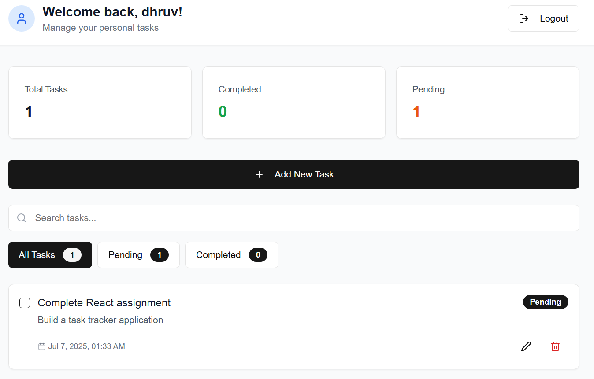
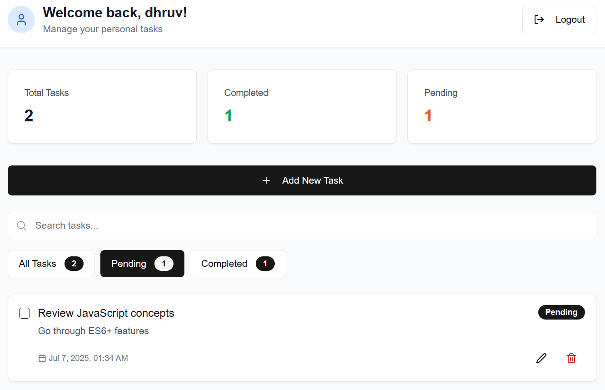
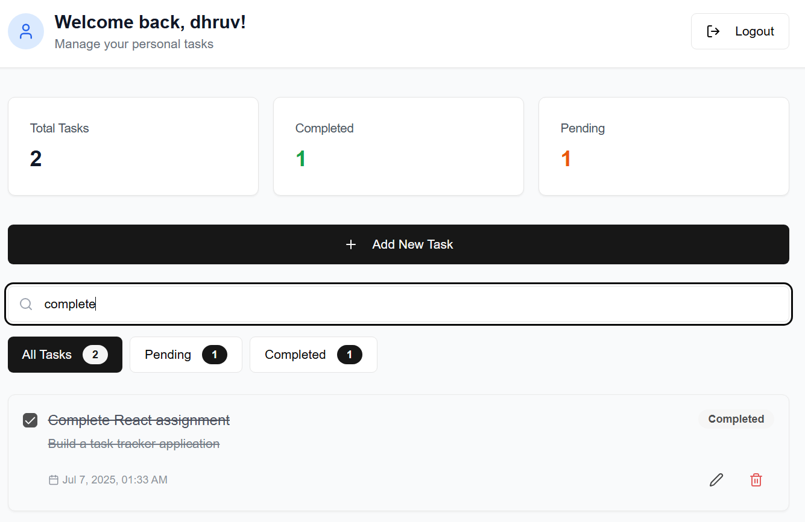

# Personal Task Tracker

## 📝 Description
A simple and modern web application to manage your personal tasks. Add, edit, filter, and track your daily to-dos with persistent local storage. Built with React and Next.js for a smooth user experience.

## 🚀 Features
- User login with persistent username
- Add, edit, and delete tasks
- Mark tasks as completed or pending
- Filter tasks (all, completed, pending)
- Search tasks by title or description
- Responsive and clean UI
- Tasks and login state persist across refreshes (localStorage)

## ⚙️ Setup Instructions
1. Clone the repository
2. Run  `pnpm install`
3. Run `pnpm run dev`
4. Open [http://localhost:3000](http://localhost:3000)

## 🛠️ Technologies Used
- React.js
- Next.js
- TypeScript
- Tailwind CSS
- [Other libraries: lucide-react, pnpm, etc.]

## 🌐 Live Demo
[Link to deployed application]

## 📸 Screenshots

---

Feel free to contribute or raise issues!
